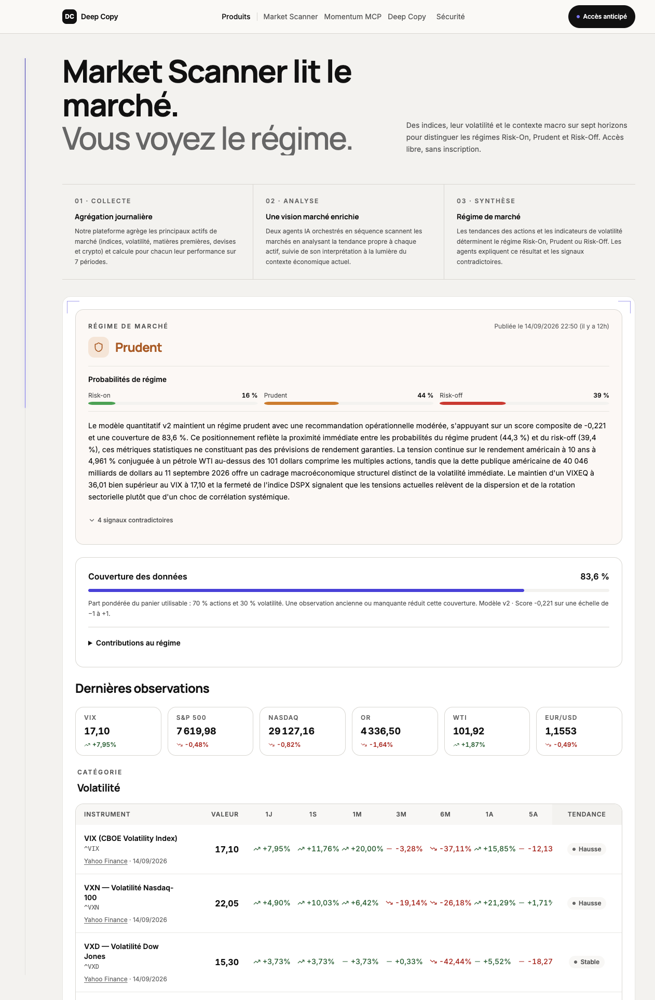
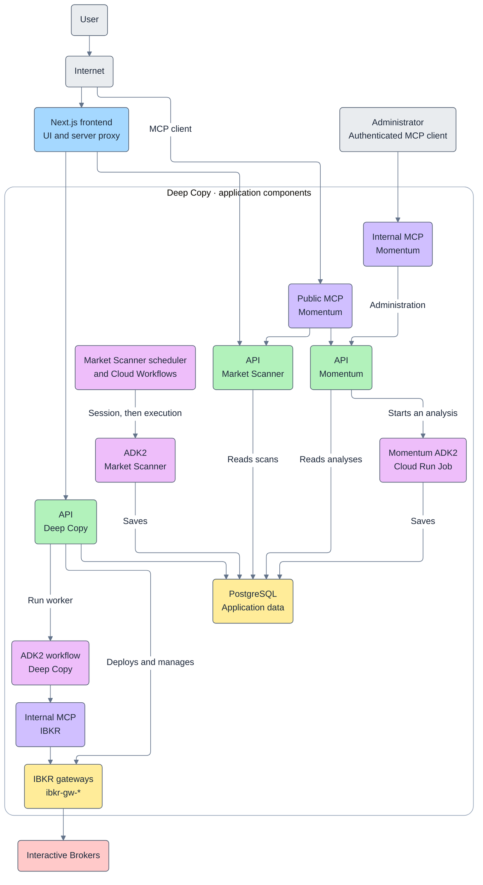

# Deepcopy

Deepcopy is a market research and trading automation project built with Google ADK. It combines daily market summaries, stock analyses available through a public Model Context Protocol (MCP) server, and an agentic trading workflow connected to Interactive Brokers (IBKR).

This repository contains the project overview, public MCP reference, and example outputs.

[](LICENCE)

[Products and status](#products-and-status) · [Quick start](#quick-start) · [Architecture](#architecture) · [MCP reference](#mcp-reference)

## Products and status

| Product | What it does | Access and status |
| :------ | :----------- | :---------------- |
| **Market Scanner** | Publishes a daily summary of major market indices and related news. | Public website; no account required. |
| **MCP Momentum** | Gives MCP clients access to stock analyses, including potential entry points and stop-loss levels. | Public MCP endpoint. |
| **Deepcopy agentic workflow** | Buys and sells shares on IBKR according to a risk profile; intended for banks and wealth management advisers. | Private preview |

See the [AMF warning about the risks of using AI to manage a portfolio](https://www.amf-france.org/fr/espace-epargnants/actualites-mises-en-garde/utiliser-lintelligence-artificielle-pour-investir-quoi-faut-il-faire-attention).

## Quick start

### Market Scanner

Open [Market Scanner](https://deepcopy.fr/#market-scanner) to read the daily analysis. No account is required.

<details>
<summary>Preview the Market Scanner</summary>



</details>

### MCP Momentum

1. Add `https://mcp.deepcopy.fr` to your preferred MCP client. The server supports protocol revision [`2026-07-28`](https://modelcontextprotocol.io/specification/2026-07-28/changelog).

2. Ask for recent stock analyses, for example: “List the latest analyses available for AAPL.”

3. Use an analysis ID returned by `list_analyses` to request the full report with `get_analysis`.

To call `list_analyses` directly from a terminal:

```bash
curl https://mcp.deepcopy.fr \
  -H 'Content-Type: application/json' \
  -H 'Accept: application/json, text/event-stream' \
  -H 'MCP-Protocol-Version: 2026-07-28' \
  -H 'Mcp-Method: tools/call' \
  -H 'Mcp-Name: list_analyses' \
  --data-raw '{
    "jsonrpc": "2.0",
    "id": "list-analyses-1",
    "method": "tools/call",
    "params": {
      "name": "list_analyses",
      "arguments": {"limit": 1},
      "_meta": {
        "io.modelcontextprotocol/protocolVersion": "2026-07-28",
        "io.modelcontextprotocol/clientInfo": {"name": "readme-example", "version": "1.0.0"},
        "io.modelcontextprotocol/clientCapabilities": {}
      }
    }
  }'
```

Check `result.isError` before using a tool response. If it is `true`, read the error message in `result.content`. A response such as `Momentum public API is unavailable.` means analysis data is unavailable through the public API, even if server discovery succeeds.

<details>
<summary>Discover the server and its supported protocol versions</summary>

```bash
curl https://mcp.deepcopy.fr \
  -H 'Content-Type: application/json' \
  -H 'Accept: application/json, text/event-stream' \
  -H 'MCP-Protocol-Version: 2026-07-28' \
  -H 'Mcp-Method: server/discover' \
  --data-raw '{
    "jsonrpc": "2.0",
    "id": "discover-1",
    "method": "server/discover",
    "params": {
      "_meta": {
        "io.modelcontextprotocol/protocolVersion": "2026-07-28",
        "io.modelcontextprotocol/clientInfo": {"name": "mon-client", "version": "1.0.0"},
        "io.modelcontextprotocol/clientCapabilities": {}
      }
    }
  }'
```

</details>

### Deepcopy agentic workflow

[Setup instructions will be added once the workflow's status and access conditions are confirmed.]

## Architecture

The project has three main flows:




- **Market Scanner** uses a graph-based execution engine to retrieve public market data from several providers. Agents research news related to market movements and produce the daily summary.
- **MCP Momentum** exposes analyses produced with a fork of the [Tauric Research project](https://tauric.ai/research/trading-r1). The public MCP server provides access to these reports and the latest market scan, and accepts ticker suggestions for moderation.
- **Deepcopy agentic workflow** connects an agentic trading workflow to IBKR and uses the investor's risk profile to guide buy and sell decisions.


## MCP reference

The public MCP server is stateless and uses protocol revision [`2026-07-28`](https://modelcontextprotocol.io/specification/2026-07-28/changelog). Each request includes the protocol version and client capabilities in `params._meta`, as shown in the quick start.

This reference follows the schemas advertised by `tools/list`. Response tables highlight selected fields. The list tools (`list_analyses`, `latest_analyses`, and `get_recommendations`) return their arrays in `result.structuredContent.result`; each item includes an `id` that can be passed to `get_analysis`.

Types use Python notation. `None` means no value is set; **—** means there is no default value.

The `rating` filters accept multiple values separated by commas:
`Buy`, `Overweight`, `Hold`, `Underweight`, `Sell`.

### `list_analyses`

Returns a paginated list of analyses, optionally filtered by ticker. Summaries include ratings, prices, RSI, trends, and P/E ratios.

**Parameters**

| Parameter | Type          | Required | Default | Description and limits          |
| :-------- | :------------ | :------: | :------ | :------------------------------ |
| `ticker`  | `str \| None` | No       | `None`  | Filter by symbol, e.g. `AAPL`.  |
| `limit`   | `int`         | No       | `50`    | Results per page. **1–200**.   |
| `offset`  | `int`         | No       | `0`     | Pagination offset.              |

**Response**

| Data         | Returned fields                                    |
| :----------- | :------------------------------------------------- |
| Identifier   | `id`, `analysis_date`                             |
| Summary      | `ticker`, `rating`, `executive_summary`            |
| Price levels | `price_target`, `entry_price`, `stop_loss`         |
| RSI          | `rsi`, `rsi_signal`                                |
| Trend        | `trend_direction`, `key_support`, `key_resistance` |
| Fundamentals | `pe_ratio`, `peg_ratio`, `beta`                    |

### `latest_analyses`

Returns the latest analysis for each ticker, with an optional portfolio rating filter.

**Parameters**

| Parameter | Type          | Required | Default | Description and limits         |
| :-------- | :------------ | :------: | :------ | :----------------------------- |
| `ticker`  | `str \| None` | No       | `None`  | Limit results to one symbol.   |
| `rating`  | `str \| None` | No       | `None`  | Filter by one or more ratings. |

**Response**

| Data      | Returned fields                         |
| :-------- | :-------------------------------------- |
| Summary   | `ticker`, `rating`, `executive_summary` |
| Decision  | `price_target`, `trader_action`         |
| Technical | `rsi`, `trend_direction`                |

### `get_analysis`

Returns the full analysis: technical indicators, fundamentals, sentiment, news, bull/bear debates, and the portfolio decision.

**Parameters**

| Parameter     | Type         | Required | Default | Description and limits |
| :------------ | :----------- | :------: | :------ | :--------------------- |
| `analysis_id` | `str` (UUID) | **Yes**  | —       | Analysis identifier.   |

**Response**

| Data         | Returned fields                         |
| :----------- | :-------------------------------------- |
| Technical    | `technical_indicators`                  |
| Fundamentals | `fundamentals`                          |
| News         | `sentiment`, `news`                     |
| Research     | `research_plan`, `debate_arguments`     |
| Decision     | `trader_proposal`, `portfolio_decision` |
| Execution    | `run_stats`                             |

### `get_recommendations`

Returns active recommendations filtered by rating. Useful for “what should I buy?” queries.

**Parameters**

| Parameter | Type  | Required | Default            | Description and limits               |
| :-------- | :---- | :------: | :----------------- | :----------------------------------- |
| `rating`  | `str` | No       | `"Buy,Overweight"` | Target ratings, separated by commas. |
| `limit`   | `int` | No       | `10`               | Number of results. **1–100**.        |

**Response**

| Data            | Returned fields                            |
| :-------------- | :----------------------------------------- |
| Recommendation  | `ticker`, `rating`                         |
| Price levels    | `price_target`, `entry_price`, `stop_loss` |
| Risk management | `position_size`, `risk_reward_ratio`       |

### `latest_market_scan`

Returns the latest daily market regime and normalized asset signals.

**Parameters:** None. Use an empty `arguments` object: `{}`.

**Response**

| Data | Returned fields |
| :--- | :-------------- |
| Identifier and dates | `id`, `scan_date`, `created_at` |
| Market regime | `regime`, `summary`, `recommendation` |
| Market observations | `assets`, `signals` |
| Session | `session_id` |

### `suggest_ticker`

Submits a ticker for administrator review without starting an analysis. Pass the returned `id` to `get_suggestion_status` to follow the moderation decision.

**Parameters**

| Parameter | Type          | Required | Default | Description and limits              |
| :-------- | :------------ | :------: | :------ | :---------------------------------- |
| `symbol`  | `str`         | **Yes**  | —       | Stock symbol, e.g. `ASML`.          |
| `reason`  | `str`         | No       | `""`    | Why this ticker should be analyzed. **Max. 500 characters**. |

**Response**

| Data | Returned fields |
| :--- | :-------------- |
| Suggestion | `id`, `symbol`, `reason`, `source` |
| Moderation | `status`, `review_reason` |
| Dates | `created_at`, `reviewed_at` |

### `get_suggestion_status`

Returns the moderation decision for a suggestion.

**Parameters**

| Parameter       | Type         | Required | Default | Description and limits                   |
| :-------------- | :----------- | :------: | :------ | :--------------------------------------- |
| `suggestion_id` | `str` (UUID) | **Yes**  | —       | The `id` returned by `suggest_ticker`.   |

**Response**

| Data       | Returned fields             |
| :--------- | :-------------------------- |
| Suggestion | `id`, `symbol`             |
| Moderation | `status`, `review_reason`   |
| Dates      | `created_at`, `reviewed_at` |


### Full analysis example

#### Request body

Replace `{{publicMcpAnalysisId}}` with an analysis ID returned by `list_analyses`. Send this body to `https://mcp.deepcopy.fr` with the same content type, accept, and protocol-version headers as the quick start, plus `Mcp-Method: tools/call` and `Mcp-Name: get_analysis`.

```json
{
  "jsonrpc": "2.0",
  "id": "get-analysis-1",
  "method": "tools/call",
  "params": {
    "name": "get_analysis",
    "arguments": {
      "analysis_id": "{{publicMcpAnalysisId}}"
    },
    "_meta": {
      "io.modelcontextprotocol/protocolVersion": "2026-07-28",
      "io.modelcontextprotocol/clientInfo": {
        "name": "readme-example",
        "version": "1.0.0"
      },
      "io.modelcontextprotocol/clientCapabilities": {}
    }
  }
}
```

#### Example response

The example below shows selected fields from an AVGO analysis dated June 11, 2026. A [complete response](assets/mcp-momentum.json) is also available.

<details>
<summary>View the example JSON response</summary>

```json
{
    "jsonrpc": "2.0",
    "id": "get-analysis-1",
    "result": {
        "isError": false,
        "resultType": "complete",
        "structuredContent": {
            "id": "e7d41cc8-19bf-480a-a558-318237b0a0d6",
            "ticker": "AVGO",
            "analysis_date": "2026-06-11",
            "created_at": "2026-06-11T14:25:04.144850Z",
            "llm_provider": "google",
            "deep_think_llm": "gemini-3.1-pro-preview",
            "quick_think_llm": "gemini-3-flash-preview",
            "next_analysis_date": "2026-06-18",
            "next_analysis_desc": "High volatility and the recent technical breakdown necessitate monitoring the stock's approach to the critical SMA 200 support level at $356.",
            "technical_indicators": {
                "close_price": 372.1,
                "close_signal": "Bearish",
                "close_comment": "The stock is undergoing a major correction after reaching historical highs.",
                "sma_50": 403.55,
                "sma_50_signal": "Bearish",
                "sma_50_comment": "The stock has fallen below its 50-day moving average, signaling a medium-term trend reversal.",
                "sma_200": 356.38,
                "sma_200_signal": "Support",
                "sma_200_comment": "The long-term trend remains technically bullish as long as the price stays above this critical support level.",
                "ema_10": null,
                "ema_10_signal": null,
                "ema_10_comment": null,
                "rsi": 37.82,
                "rsi_signal": "Neutral",
                "rsi_comment": "RSI is approaching oversold territory but indicates there is still room for further downside before a rebound.",
                "macd": -1.91,
                "macd_signal": "Bearish",
                "macd_comment": "The MACD has crossed below the signal line into negative territory, indicating accelerating downward momentum.",
                "macd_signal_val": null,
                "macd_histogram": null,
                "boll_upper": 479.06,
                "boll_upper_signal": "Resistance",
                "boll_upper_comment": "This level marks the volatility peak reached during the record highs in early June.",
                "boll_lower": 367.29,
                "boll_lower_signal": "Support",
                "boll_lower_comment": "The lower Bollinger Band serves as a potential zone for a technical rebound during this liquidation phase.",
                "atr": 23.15,
                "atr_signal": "High Volatility",
                "atr_comment": "Extreme market instability suggests that traders should utilize wider stop-loss orders to manage risk.",
                "vwma": 424.64,
                "vwma_signal": "Bearish",
                "vwma_comment": "The significant gap between the price and the VWMA confirms heavy selling pressure backed by volume.",
                "mfi": null,
                "mfi_signal": null,
                "mfi_comment": null,
                "trend_direction": "Downtrend",
                "momentum_state": "Accelerating",
                "volatility_regime": "Extreme",
                "key_support": 356.38,
                "key_resistance": 403.55,
                "actionable_recommendation": "Hold",
                "summary_short": "Broadcom (AVGO) is experiencing a sharp correction, testing critical support levels between $356 and $367. High volatility and bearish momentum suggest caution as the price sits below its 50-day SMA."
            },
            "fundamentals": {
                "market_cap": 1791.0,
                "pe_ratio": 62.44,
                "forward_pe": 19.46,
                "peg_ratio": 0.72,
                "eps_ttm": null,
                "forward_eps": 19.35,
                "revenue": 75.46,
                "net_income": 29.32,
                "profit_margin": 38.85,
                "operating_margin": 48.99,
                "roe": 37.28,
                "roa": null,
                "debt_to_equity": 0.74,
                "current_ratio": 2.24,
                "free_cash_flow": 27.21,
                "total_cash": 19.63,
                "capex": null,
                "dividend_yield": 0.7,
                "beta": null,
                "financial_health": "Strong",
                "growth_outlook": "Very Strong",
                "valuation_assessment": "Undervalued",
                "summary_short": "Broadcom exhibits exceptional growth with a 48% YoY revenue increase and elite operating margins near 49%. Despite its mega-cap status, a PEG ratio of 0.72 suggests the stock is currently undervalued relative to its AI-driven growth trajectory."
            },
            "run_stats": {
                "agents_total": 12,
                "agents_completed": 12,
                "llm_calls": 29,
                "tool_calls": 0,
                "tokens_in": 140163,
                "tokens_out": 51873,
                "reports_total": 7,
                "reports_completed": 7,
                "duration_seconds": 336.56
            }
        },
        "_meta": {
            "io.modelcontextprotocol/serverInfo": {
                "name": "Momentum Public",
                "version": "0.1.0"
            }
        }
    }
}
```

</details>

## Google ADK resources

- **Getting Started**: https://google.github.io/adk-docs/
- **Guides**: See
  [`docs/guides/`](https://github.com/google/adk-python/tree/main/docs/guides)
  for task-oriented walkthroughs of agents, tools, events, plugins, and
  workflows.


## Contributing

We welcome contributions from the community! Whether it's bug reports, feature requests, documentation improvements, or code contributions, please see our:

- [Code Contributing Guidelines](./CONTRIBUTING.md) to get started.


## License

This project is licensed under the Apache 2.0 License — see the
[LICENCE](LICENCE) file for details.

______________________________________________________________________

*Happy trading !*
